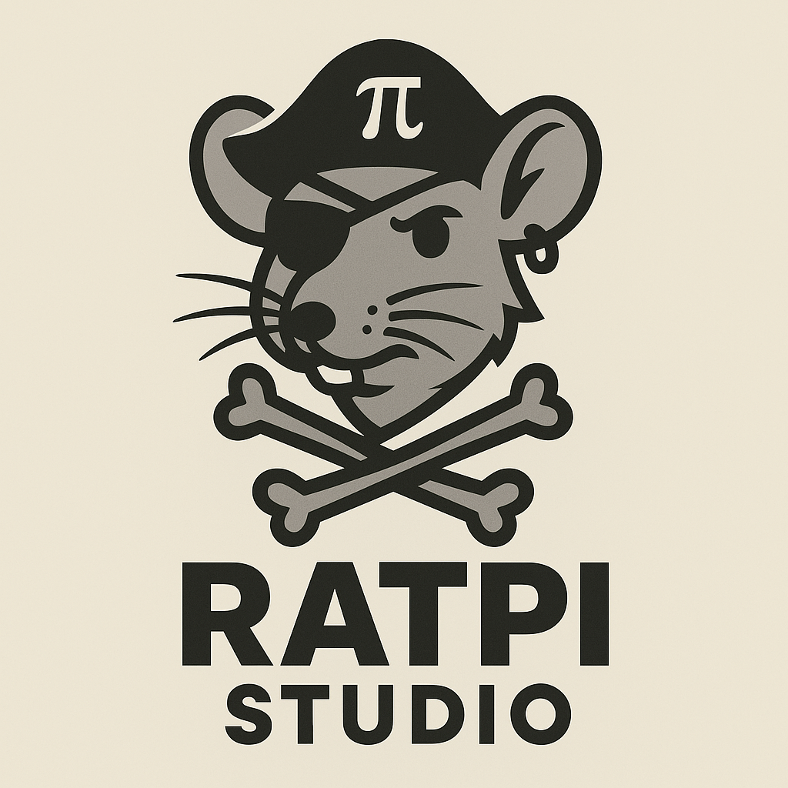

<p align="center">
  
</p>

# Ratpi CLI

[](https://github.com/ratpi-studio/ratpi-cli/actions/workflows/ci.yml)
[](https://github.com/ratpi-studio/ratpi-cli/actions/workflows/release.yml)
[](LICENSE)

`ratpi-cli` is a utility for quickly generating script templates using [Commander](https://github.com/tj/commander.js/) and [Chalk](https://github.com/chalk/chalk).

---

## 🚀 Installation

You can run it directly with `npx`:

```bash
npx ratpi-cli create-script:init
```

## 🛠 Usage

```
ratpi-cli create-script:init [options]
```

Options:

- `--template <name>` – use one of the built-in templates located in `templates/`.
- `--use <path>` – path to a JSON configuration file describing the commands.
- `--no-install-deps` – skip installing `commander` and `chalk` as devDependencies in the current project.
- `--output <dir>` – directory where the project will be generated. If not provided you will be prompted.

A configuration file should look like:

```json
{
  "name": "supercli",
  "description": "An all-in-one CLI tool to automate your tasks.",
  "version": "1.0.0",
  "args": [
    {
      "name": "name",
      "small": "n",
      "type": "string",
      "required": false,
      "description": "Name of the person to greet",
      "example": "Alex",
      "interactive": true
    }
  ]
}
```

This will create a new folder `my-script` containing an executable `index.js` using Commander and Chalk.

## 🤖 AI Agent

The `agent` command runs a small Gemini Flash 2.0 powered agent. Set `GEMINI_API_KEY` in your environment and provide a goal:

```bash
ratpi-cli agent "build me a project"
```

## 🧑‍💻 Development

```bash
bun install
bun run build
```

## ⚙️ Continuous Integration

A simple GitHub Actions workflow is provided in `.github/workflows/ci.yml` to run the build.

## 🌐 More info

Visit [ratpi-studio.com](https://ratpi-studio.com) for more tools and documentation.
